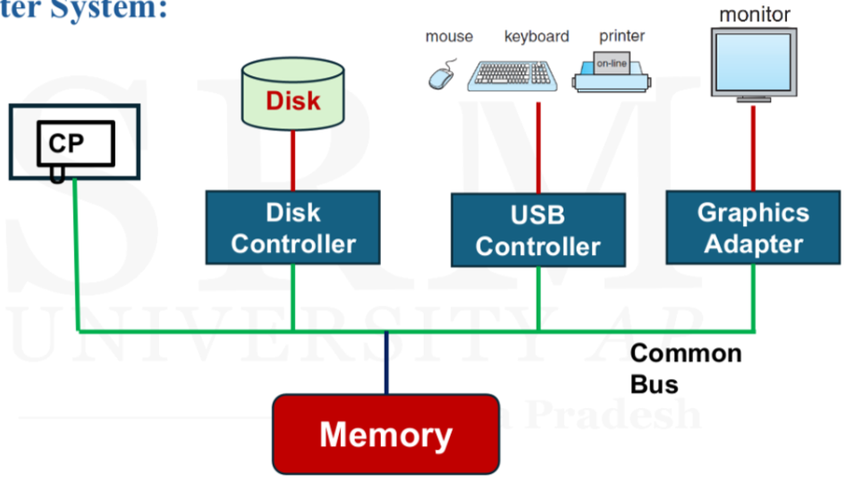
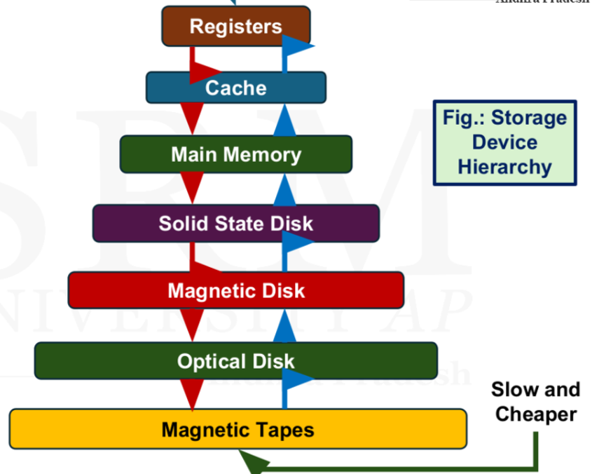
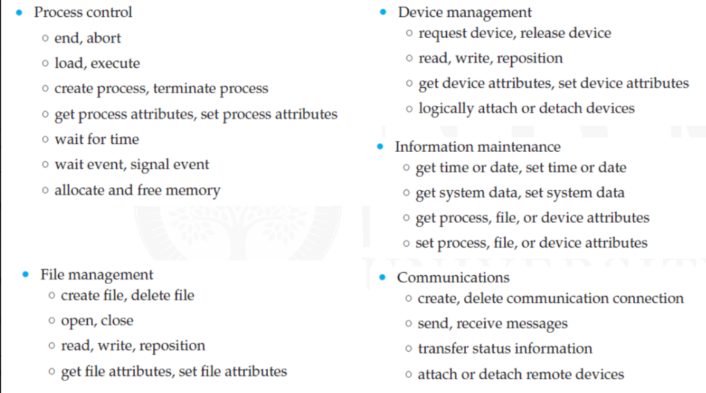
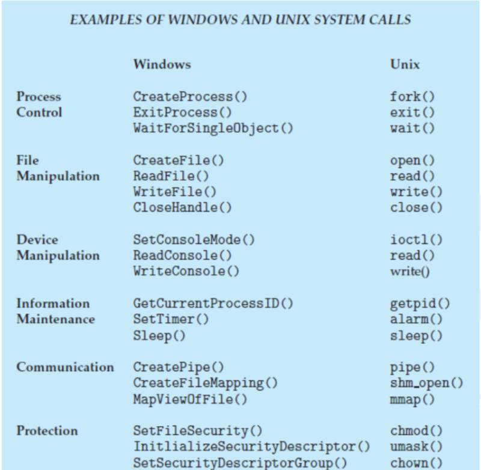

# Unit 1

# **Unit 1  Introduction to Operating System**

## What is a Computer System

- A **Computer System** is an integrated system composed of hardware, software, and peripheral devices that work together to perform computing tasks.
- A computer system consists of many resources that are useful for completing a task.

### Components of Computer System

### 1. **Computer Hardware**

- **Definition**: The physical components of a computer system that you can touch and see. This includes all the tangible elements that make up a computer.
- **Examples**:
    - **Central Processing Unit (CPU)**: The brain of the computer that performs calculations and executes instructions.
    - **Memory**: Includes both primary memory (RAM) for temporary data storage and secondary memory (hard drives, SSDs) for long-term data storage.
    - **Input/Output Devices**: Keyboards, mice, monitors, printers, etc., which allow users to interact with the computer and receive output from it.
    - **Motherboard and Other Internal Components**: The motherboard connects all the internal hardware components and allows them to communicate with each other.

### 2. **Operating System**

- **Definition**: The system software that manages hardware resources and provides an environment for application programs to run. It acts as an intermediary between the hardware and the user.
- **Functions**:
    - **Resource Management**: Manages the CPU, memory, disk drives, and other hardware.
    - **File System Management**: Organizes and manages files on storage devices.
    - **User Interface**: Provides a way for users to interact with the computer, either through a command-line interface (CLI) or a graphical user interface (GUI).
    - **Process Management**: Manages the execution of processes, including task scheduling, multitasking, and handling interruptions.

### 3. **Application Programs**

- **Definition**: Software designed to perform specific tasks for the user, running on top of the operating system.
- **Examples**:
    - **Productivity Software**: Word processors, spreadsheets, and presentation software (e.g., Microsoft Office, Google Docs).
    - **Web Browsers**: Software to access the internet (e.g., Chrome, Firefox).
    - **Media Players**: Applications for playing audio and video files (e.g., VLC Media Player).
    - **Games**: Software designed for entertainment and gaming purposes.
- **Purpose**: Application programs allow users to perform a wide variety of tasks, from creating documents and editing images to browsing the web and playing games.

### 4. **Users**

- **Definition**: The individuals who interact with the computer system to perform tasks or operate programs.
- **Types of Users**:
    - **End Users**: General users who interact with application programs for specific tasks (e.g., typing a document, browsing the internet).
    - **Administrators**: Users who manage the overall operations of a computer system, including maintaining the OS, installing software, and managing user accounts.
    - **Developers**: Users who create software programs by writing code and developing applications.
- **Role**: Users provide the instructions and input that drive the operations of a computer system. They rely on the hardware, OS, and application programs to accomplish their tasks.

Each of these components plays a critical role in the overall functionality of a computer system, and they all work together to enable computing tasks to be performed efficiently and effectively.

## Software

 **Software** is a collection of instructions, data, or programs used to operate computers and execute specific tasks. Unlike hardware, which is the physical aspect of a computer, software is intangible and consists of code written by developers. It tells the computer hardware what to do and how to perform specific tasks.

### Types of Software

1. **System Software**:
    - **Definition**: Software that manages and controls the hardware components and provides a platform for running application software.
    - **Examples**:
        - **Operating System (OS)**: The most critical type of system software that manages all hardware and other software on a computer. Examples include Windows, macOS, Linux, and Android.
        - **Device Drivers**: Specialized programs that allow the operating system to communicate with hardware devices like printers, graphics cards, and network cards.
        - **Utilities**: System management tools that perform maintenance tasks, such as antivirus programs, disk cleanup tools, and backup software.
2. **Application Software**:
    - **Definition**: Software designed to help users perform specific tasks or activities.
    - **Examples**:
        - **Productivity Software**: Word processors, spreadsheets, and presentation software (e.g., Microsoft Office, Google Docs).
        - **Web Browsers**: Software used to access the internet (e.g., Chrome, Firefox, Safari).
        - **Media Players**: Applications for playing audio and video files (e.g., VLC Media Player).
        - **Games**: Software designed for entertainment (e.g., Fortnite, Minecraft).
        - **Business Software**: Applications like Customer Relationship Management (CRM) systems, Enterprise Resource Planning (ERP) systems, and accounting software.
3. **Programming Software**:
    - **Definition**: Tools that developers use to write, test, and debug software.
    - **Examples**:
        - **Integrated Development Environments (IDEs)**: Software that provides comprehensive facilities to programmers for software development (e.g., Visual Studio, Eclipse).
        - **Compilers**: Programs that translate code written in high-level programming languages into machine code that the computer can execute.
        - **Debuggers**: Tools used to test and debug code to find and fix errors.
4. **Firmware**:
    - **Definition**: A specific type of software that is embedded into hardware devices to provide low-level control for the device’s specific hardware.
    - **Examples**:
        - **BIOS/UEFI**: Firmware used during the booting process of a computer to initialize hardware and load the operating system.
        - **Embedded Systems**: Software in devices like routers, washing machines, and cars that controls specific functions.

### Key Characteristics of Software

- **Intangibility**: Unlike hardware, software doesn’t have a physical presence.
- **Customizability**: Software can be modified and updated to add new features or fix bugs.
- **Functionality**: Software is designed to perform specific tasks, whether it's managing resources, processing data, or interacting with users.
- **Dependency on Hardware**: Software requires hardware to run, and its performance can be influenced by the hardware's capabilities.

### Importance of Software

- **Enables Functionality**: Software is what enables hardware to perform useful tasks.
- **User Interaction**: It provides the interface through which users interact with computers and other digital devices.
- **Automation**: Software allows for the automation of complex tasks, improving efficiency and productivity.

In summary, software is the essential component that brings hardware to life, enabling it to perform various tasks and allowing users to interact with digital devices in meaningful ways.

## Operating System

- An Operating System (OS) acts as an interface between the user and the
hardware to perform various tasks.
- An Operating System (OS) is a system software that manages computer
hardware, software resources, and provides common service for computer
programs.

### Functions of OS

### 1. **Process Management**

- **Definition**: Manages the creation, scheduling, and termination of processes. It ensures that each process gets the necessary CPU time and resources to execute efficiently.
- **Functions**: Handles multitasking, process synchronization, and inter-process communication.

### 2. **Resource Management**

- **Definition**: Allocates and manages the computer's resources, such as CPU time, memory space, and I/O devices, among various applications and users.
- **Functions**: Ensures fair resource distribution and avoids conflicts between different processes.

### 3. **Memory Management**

- **Definition**: Manages the system's memory, ensuring that each process has enough memory to execute and that the memory is used efficiently.
- **Functions**: Includes memory allocation, deallocation, paging, and segmentation.

### 4. **Device (I/O Systems) Management**

- **Definition**: Manages input/output devices like printers, disks, and keyboards, ensuring smooth data transfer between the devices and the computer.
- **Functions**: Includes device drivers, I/O scheduling, and buffering.

### 5. **File (Storage) Management**

- **Definition**: Organizes and controls how data is stored on storage devices, such as hard drives and SSDs, and provides a way to create, delete, and access files.
- **Functions**: Manages file permissions, directories, and data retrieval.

### 6. **Security**

- **Definition**: Protects the system's data and resources from unauthorized access, ensuring that only authorized users can access or modify information.
- **Functions**: Includes user authentication, access control, and data encryption.

### 7. **Job Accounting**

- **Definition**: Tracks the resources used by each process or user, such as CPU time, memory usage, and I/O operations.
- **Functions**: Helps in monitoring system performance and can be used for billing in time-sharing environments.

### 8. **Networking**

- **Definition**: Manages network communication, allowing computers to connect, communicate, and share resources over a network.
- **Functions**: Includes network protocols, data transmission, and resource sharing.

### 9. **Virtualization**

- **Definition**: Allows multiple operating systems to run on a single physical machine by creating virtual machines, each with its own resources.
- **Functions**: Enables efficient resource utilization and isolation between different virtual environments.

### 10. **System Calls**

- **Definition**: Provides an interface for application programs to request services from the OS, such as file operations, process control, and communication.
- **Functions**: Acts as a bridge between user applications and the OS's functionality.

### 11. **Error-detecting Aids**

- **Definition**: Monitors the system for errors, such as hardware failures, software bugs, and security breaches, and takes corrective action when necessary.
- **Functions**: Includes error logging, system alerts, and recovery mechanisms to ensure system stability.

These functions collectively enable the OS to manage the computer's operations, ensuring that hardware and software resources are used efficiently and securely.

### Objectives of Operating System

### 1. **Convenient to Use**

- **Objective**: The OS should make the computer system easy and convenient to use, allowing users to perform tasks efficiently without needing in-depth technical knowledge.
- **Explanation**: By managing complex tasks like resource allocation, file management, and process scheduling, the OS simplifies the user’s interaction with the hardware, enabling them to focus on their work rather than on how the computer operates.

### 2. **User Friendly**

- **Objective**: The OS should provide a user-friendly interface, making it accessible to both novice and advanced users.
- **Explanation**: This is achieved through intuitive graphical user interfaces (GUIs), clear instructions, and helpful error messages, all of which contribute to a positive user experience.

### 3. **Easy Access**

- **Objective**: The OS should allow users to easily access and manage files, applications, and hardware devices.
- **Explanation**: By providing well-organized file systems, user-friendly interfaces, and straightforward access controls, the OS ensures that users can quickly find and use the resources they need without unnecessary complexity.

### 4. **Management of Resources**

- **Objective**: The OS should efficiently manage the computer’s resources, including the CPU, memory, storage, and I/O devices.
- **Explanation**: This involves allocating resources to different processes and users in a way that optimizes performance and prevents conflicts or bottlenecks, ensuring that the system runs smoothly.

### 5. **Controls and Monitoring**

- **Objective**: The OS should control and monitor system operations to ensure that everything functions as intended.
- **Explanation**: This includes overseeing process execution, managing hardware devices, detecting errors, and maintaining overall system stability. The OS provides tools for administrators to monitor performance, track resource usage, and troubleshoot issues.

### 6. **Fair Sharing of Resources**

- **Objective**: The OS should ensure that all users and processes have fair access to system resources.
- **Explanation**: By implementing scheduling algorithms and resource allocation policies, the OS prevents any single user or process from monopolizing resources, promoting fairness and preventing performance degradation for other users or tasks.

These objectives guide the design and functionality of an operating system, ensuring that it meets the needs of users while efficiently managing the underlying hardware and software resources.

### Evolution of Operating System

The evolution of operating systems has been marked by significant advancements driven by technological progress and the changing needs of users and industries. Here’s an overview of the key stages in the evolution of operating systems:

### 1. **No Operating System – (Before 1940)**

- **Description**: During this period, computers were manually operated without any operating system. Users interacted directly with the hardware using machine language or assembly language.
- **Operation**: Programs were entered via switches or punched cards, and the execution was controlled manually. Computers could only run one program at a time, with no concept of multitasking or automation.

### 2. **Batch Processing Systems – (1940 to 1950)**

- **Description**: The earliest form of operating systems, where jobs (programs) were collected, grouped into batches, and processed sequentially without user interaction.
- **Operation**: Users submitted jobs on punched cards to an operator, who then fed them into the computer system. The system executed one job after another, producing output only after the entire batch was processed.
- **Limitation**: Lack of interaction and slow processing, as jobs had to wait until the entire batch was completed.

### 3. **Multiprogramming Systems – (1950 to 1960)**

- **Description**: Introduction of multiprogramming, where multiple jobs were loaded into memory at the same time, and the CPU was shared among them to maximize utilization.
- **Operation**: The CPU would switch between jobs when one was waiting for I/O operations, increasing efficiency and reducing idle time. This laid the foundation for multitasking.
- **Advantage**: Better utilization of resources, as the CPU was kept busy, even when some jobs were waiting for input/output operations.

### 4. **Time-Sharing Systems – (1960 to 1970)**

- **Description**: A significant advancement where multiple users could interact with the computer simultaneously, each getting a small "time slice" of the CPU.
- **Operation**: Time-sharing systems allowed multiple users to work on terminals connected to a central computer, giving the illusion of concurrent processing.
- **Impact**: Made computers more interactive, paving the way for modern computing experiences where multiple users can run applications simultaneously.

### 5. **Introduction of GUI Operating Systems – (1970 to 1980)**

- **Description**: The development of Graphical User Interface (GUI) operating systems, which made computers more accessible to non-technical users by replacing text-based interfaces with visual elements.
- **Operation**: GUIs introduced windows, icons, menus, and pointers (WIMP) that users could interact with using a mouse. This period saw the development of early GUI systems like Xerox PARC’s Alto, leading to mainstream GUIs like Apple's Macintosh and Microsoft Windows.
- **Impact**: Revolutionized personal computing by making it easier for the general public to use computers.

### 6. **Network Operating System – (1980 to 1990)**

- **Description**: Operating systems designed to manage and facilitate networking, enabling computers to communicate and share resources over local area networks (LANs) and wide area networks (WANs).
- **Operation**: Network Operating Systems (NOS) provided services like file sharing, printer access, and network security, and were crucial in business environments.
- **Examples**: Novell NetWare, Microsoft Windows NT, and UNIX-based systems.

### 7. **Mobile Operating Systems – (Late 1990s to Early 2000s)**

- **Description**: The rise of mobile devices like smartphones and tablets led to the development of specialized operating systems optimized for portability, touch interfaces, and power efficiency.
- **Operation**: Mobile operating systems like Apple’s iOS and Google’s Android became dominant, providing a platform for mobile apps and seamless integration with internet services.
- **Impact**: Transformed how people interact with technology, leading to the proliferation of mobile computing and app ecosystems.

### 8. **AI Integration Operating System – (2010 to Ongoing)**

- **Description**: The integration of artificial intelligence (AI) into operating systems, enabling more intelligent and adaptive user experiences through features like voice assistants, predictive analytics, and automated system management.
- **Operation**: Modern operating systems increasingly leverage AI for tasks such as personal assistants (e.g., Siri, Google Assistant), security (e.g., behavior-based threat detection), and optimizing system performance.
- **Impact**: AI integration is making operating systems smarter, more responsive, and capable of automating complex tasks, shaping the future of human-computer interaction.

This timeline highlights the key milestones in the evolution of operating systems, reflecting the continuous advancement in technology and the changing demands of users and industries.

## Computer System Organization

**Computer System Organization** refers to the structure and operational dynamics of a computer's hardware and how it interacts with software to perform computing tasks. It encompasses the various components of a computer system and how they work together to process, store, and output data. Here’s an overview of the key elements involved in computer system organization:

1. **CPU (Central Processing Unit)**: The brain of the computer, executing instructions and processing data. It includes the Arithmetic Logic Unit (ALU), Control Unit (CU), and registers.
2. **Memory (Primary Storage)**: Temporary storage for data and instructions currently being used by the CPU. Includes RAM (volatile) and cache memory for quick access.
3. **Secondary Storage**: Permanent storage for data, such as hard drives (HDDs), solid-state drives (SSDs), and optical discs.
4. **Input Devices**: Tools like keyboards, mice, and scanners that allow users to input data into the computer.
5. **Output Devices**: Devices like monitors, printers, and speakers that display or output data from the computer.
6. **System Bus**: Communication pathways (data, address, and control buses) that transfer data between the CPU, memory, and other components.
7. **Motherboard**: The main circuit board housing the CPU, memory, and connectors for other components and peripherals.
8. **I/O System**: Manages data transfer between the CPU and external devices through I/O ports and controllers.
9. **Power Supply Unit (PSU)**: Converts electrical power into a usable form for the computer's internal components.
10. **Networking Components**: Enable computers to connect and communicate over networks, including NICs, routers, and switches.
11. **Operating System (OS)**: Manages hardware resources and provides a platform for running applications.
12. **System & Application Software**: System software (like OS) manages the hardware, while application software performs specific tasks for users.
13. **Firmware**: Low-level software stored on chips that controls hardware, such as BIOS/UEFI for booting.

This summary covers the key components and their roles in a computer system.

### Computer-System Operation

A modern general-purpose computer system consists of one or more CPUs and number of device controllers connected through a common bus that provides access to shared memory.

### How Computer Turns on and Starts Running?

### **1) How a Computer Turns On and Starts Running**

- **Power On**: When you press the power button, the computer's Power Supply Unit (PSU) provides power to the motherboard and all components. This triggers the Basic Input/Output System (BIOS) or Unified Extensible Firmware Interface (UEFI) firmware to start.
- **BIOS/UEFI Initialization**: The BIOS/UEFI performs a Power-On Self Test (POST) to check the hardware components, such as the CPU, RAM, and storage devices. If everything is functioning correctly, the BIOS/UEFI then looks for a bootable device (like a hard drive or SSD) to load the operating system.
- **Bootloader Execution**: The bootloader, such as GRUB or the Windows Boot Manager, is responsible for loading the operating system kernel into memory.
- **Operating System Loading**: The OS kernel initializes system services, loads device drivers, and sets up the system for user interaction. It also starts the system daemons and background processes required for the OS to function properly.
- **User Interface Presentation**: Finally, the OS presents the user interface (either GUI or CLI), allowing the user to log in and begin using the computer.

### **2) Instruction Execution Cycle**

- **Instruction Fetch**: The CPU fetches an instruction from the memory. The address of the next instruction is held in the Program Counter (PC), which is incremented after each fetch.
- **Instruction Decode**: The fetched instruction is loaded into the Instruction Register (IR), where the CPU decodes it to determine the operation to be performed.
- **Instruction Execute**: The CPU executes the decoded instruction, which may involve arithmetic operations, data transfer, or control operations.
- **Write Back**: If the instruction affects memory or a register, the result is written back to the appropriate location.
- **HALT**: If the CPU does not need to save the process state or execute further instructions, it may halt the process.

*For a more detailed explanation, refer to your textbook, Chapter 1, Topic 1.2.1.*

### **3) System Processes or System Daemons**

- **Definition**: System daemons are background processes that start when the operating system boots and continue to run without user intervention.
- **Role**: These processes handle essential system tasks, such as managing hardware components, network connections, and system maintenance. They ensure the smooth operation of the OS by providing necessary services to other software and the system itself.
- **Examples**: Common daemons include `cron` for task scheduling, `sshd` for managing secure shell connections, and `syslogd` for logging system messages.

*For further details, refer to your textbook, Chapter 1, Topic 1.2.1.*

### **4) Interrupt**

- **Definition**: An interrupt is a signal sent by hardware or software to the CPU, indicating that an event needs immediate attention.
- **Types**:
    - **Hardware Interrupt**: Generated by hardware devices like keyboards, mice, or network cards when they need the CPU to process data.
    - **Software Interrupt**: Generated by programs when they require OS services via system calls.
    - **Maskable Interrupt**: Can be ignored or delayed by the CPU if needed.
    - **Non-Maskable Interrupt (NMI)**: Cannot be ignored and must be processed immediately.

*For more details, refer to the referenced textbook and resources like [JavaTpoint on Interrupts](https://www.javatpoint.com/what-is-interrupt-in-os).*

### **5) Interrupt Handling**

- **Process**:
    - When an interrupt occurs, the CPU stops its current activities and saves the state of the ongoing process.
    - The CPU then transfers control to the Interrupt Service Routine (ISR), which handles the specific interrupt.
    - After the ISR has processed the interrupt, the CPU restores the saved state and resumes the interrupted process.
- **Interrupt Vector**: A table in memory that contains the addresses of ISRs. The CPU uses this table to quickly find the correct ISR when an interrupt occurs.

### Storage Structure

**Storage Structure** in a computer system refers to the hierarchy and organization of various storage devices that store data and instructions, both temporarily and permanently. Here's a detailed overview of the storage structure:

### 1. **Primary Storage (Main Memory)**

- **Role**: Holds data and instructions that the CPU is currently processing. It is volatile, meaning it loses its contents when the power is turned off.
- **Components**:
    - **Random Access Memory (RAM)**:
        - **Dynamic RAM (DRAM)**: Commonly used as the main system memory, where data is stored in capacitors and needs to be refreshed periodically.
        - **Static RAM (SRAM)**: Faster and more expensive than DRAM, typically used for cache memory.
    - **Cache Memory**: A smaller, faster type of volatile memory that stores copies of frequently accessed data from main memory. It is divided into levels:
        - **L1 Cache**: Integrated directly into the CPU, offering the fastest access to data.
        - **L2 Cache**: Slightly larger and slower than L1, but still faster than main memory.
        - **L3 Cache**: Even larger and slower, shared among multiple CPU cores.
    - **Registers**: Small, high-speed storage locations within the CPU that hold data and instructions currently being executed.

### 2. **Secondary Storage**

- **Role**: Provides non-volatile, long-term storage for data and programs that are not currently in use. Data remains stored even when the power is off.
- **Components**:
    - **Hard Disk Drives (HDDs)**: Traditional magnetic storage devices that store data on spinning platters. They offer large storage capacities at relatively low cost but are slower than SSDs.
    - **Solid-State Drives (SSDs)**: Storage devices that use flash memory to store data. They are faster, more durable, and more energy-efficient than HDDs, though typically more expensive per gigabyte.
    - **Optical Discs**: Storage media such as CDs, DVDs, and Blu-ray discs, which use lasers to read and write data. These are often used for media distribution and backup.
    - **Flash Drives**: Portable storage devices, such as USB flash drives and memory cards, that use flash memory for quick and easy data transfer.
    - **External Hard Drives**: Portable storage devices that can be connected to a computer via USB or other interfaces, used for backup and extra storage.

### 3. **Tertiary Storage**

- **Role**: Used for storing data that is not frequently accessed. It typically involves removable media and is often used for backup or archival purposes.
- **Components**:
    - **Magnetic Tape**: A storage medium that uses magnetic tape to record data. It is slow but can store large amounts of data, making it ideal for archival storage.
    - **Cloud Storage**: Online storage provided by third-party services where data is stored on remote servers and can be accessed over the internet. It offers scalability and remote accessibility but depends on network availability.

### 4. **Volatile vs. Non-Volatile Storage**

- **Volatile Storage**:
    - **Definition**: Storage that requires power to maintain the stored information.
    - **Examples**: RAM, cache memory.
- **Non-Volatile Storage**:
    - **Definition**: Storage that retains data even when the power is turned off.
    - **Examples**: HDDs, SSDs, optical discs, flash drives.

### 5. **Storage Hierarchy**

- **Definition**: The organization of different storage types based on speed, cost, and capacity. The hierarchy typically follows this order from fastest to slowest:
    1. **Registers**
    2. **Cache (L1, L2, L3)**
    3. **Main Memory (RAM)**
    4. **Secondary Storage (HDDs, SSDs)**
    5. **Tertiary Storage (Magnetic Tape, Cloud Storage)**

### 6. **Virtual Memory**

- **Role**: A technique that allows the system to compensate for physical memory shortages by temporarily transferring data from RAM to disk storage. This creates the illusion of a larger main memory.
- **Components**:
    - **Paging**: Divides memory into fixed-size pages and swaps them in and out of physical memory as needed.
    - **Swapping**: The process of moving entire processes between main memory and secondary storage to free up RAM.

### 7. **File Systems**

- **Role**: Manages how data is stored and retrieved on a storage device. It organizes data into files and directories, allowing for efficient access and management.
- **Examples**:
    - **NTFS**: Used by Windows systems, known for its security features and support for large volumes.
    - **EXT4**: Commonly used in Linux systems, offering journaling and large file support.
    - **APFS**: Used by macOS, designed for modern flash storage with strong encryption and space efficiency.

### Conclusion

The storage structure of a computer system is designed to provide a balance between speed, cost, and capacity. It ranges from very fast, volatile storage like registers and cache to slower, non-volatile storage like HDDs and cloud storage. Understanding this structure is crucial for optimizing performance and effectively managing data.

### I/O Structure

### **I/O Structure in a General-Purpose Computer System**

In a general-purpose computer system, **Input/Output (I/O) Structure** plays a crucial role in managing the communication between the CPU and peripheral devices like keyboards, printers, and storage devices. Here’s a breakdown of the I/O structure based on the details provided:

### **1. Device Controllers and the Common Bus**

- **Device Controllers**: These are specialized circuits that manage the data exchange between the peripheral devices (e.g., hard drives, printers) and the computer system. Each device controller is responsible for a specific type of device and has its own set of special-purpose registers and local buffer storage.
- **Common Bus**: The CPU, device controllers, and memory are interconnected via a common bus. This bus is the communication pathway through which data and control signals are transmitted between the CPU and peripheral devices.

### **2. Small Computer System Interface (SCSI)**

- **SCSI Controller**: A widely used interface standard that allows multiple peripheral devices (typically seven or more) to connect to a single SCSI controller. The SCSI controller manages communication between the devices and the CPU, enabling them to share the common bus effectively.
- **Device Connection**: Multiple devices, such as hard drives, scanners, and printers, can be attached to the SCSI controller, which then handles data transfer between these devices and the system.

### **3. I/O Operation Process**

- **Starting an I/O Operation**:
    - The **device driver** (software that communicates with the device) initiates an I/O operation by loading the appropriate data and commands into the special-purpose registers of the device controller.
    - The **device controller** examines these registers to determine the required action, such as reading or writing data.
    - The controller then starts the data transfer process between the device and its local buffer.

### **4. Interrupt-Driven I/O**

- **Interrupt Mechanism**: In this method, the device controller notifies the CPU when the data transfer to or from the device is complete by sending an interrupt signal. The CPU then handles the interrupt and continues processing the data.
- **Limitations**: While interrupt-driven I/O is effective for transferring small amounts of data, it can become inefficient for bulk data transfers, such as those required by disk I/O. The frequent interrupts can create significant overhead, slowing down the overall system performance.

### **5. Direct Memory Access (DMA)**

- **Definition**: DMA is a technique used to improve efficiency during bulk data transfers. Instead of relying on the CPU to manage the entire data transfer process, the DMA controller takes over the transfer directly between the device and main memory, bypassing the CPU.
- **Operation**:
    - The CPU initiates the DMA transfer by specifying the source, destination, and amount of data to be transferred.
    - The DMA controller manages the data transfer, allowing the CPU to perform other tasks while the transfer is in progress.
    - Once the transfer is complete, the DMA controller sends an interrupt to the CPU to signal that the operation has finished.

### **Conclusion**

The I/O structure of a general-purpose computer system is designed to efficiently manage communication between the CPU and various peripheral devices. Device controllers, SCSI interfaces, and methods like interrupt-driven I/O and Direct Memory Access (DMA) are crucial for ensuring that data is transferred quickly and reliably, with minimal CPU intervention. This structure helps maintain system performance, especially when dealing with large volumes of data.

 **

### Computer-System Architecture

Computer-system architecture refers to the structure and organization of a computer's hardware components. Depending on the number of general-purpose processors, computer systems can be categorized into different types, each with its own characteristics and benefits. Below is an overview based on the provided categories:

### **1. Single-Processor Systems**

- **Definition**: A single-processor system consists of one central processing unit (CPU) that manages the entire operation of the computer. The CPU executes all instructions, manages memory, and handles input/output operations.
- **Characteristics**:
    - **Simplicity**: Single-processor systems are easier to design, manage, and maintain due to their simpler architecture.
    - **Cost-Effective**: Typically less expensive compared to systems with multiple processors.
- **Benefits**:
    - **Increased Throughput**: Although single-processor systems have only one CPU, they can still achieve significant throughput by optimizing CPU utilization and minimizing idle time.
    - **Economy of Scale**: Manufacturing and maintaining single-processor systems are generally more economical due to their simplicity and widespread adoption.
    - **Increased Reliability**: With fewer components, there is a lower chance of hardware failure, making these systems more reliable for certain applications.

### **2. Multiprocessor Systems (Parallel Systems or Multicore Systems)**

- **Definition**: Multiprocessor systems have two or more CPUs that share a common physical memory, and work together to execute instructions in parallel. These systems are also known as parallel systems or multicore systems, depending on the specific configuration.
- **Types**:
    - **Symmetric Multiprocessing (SMP)**: All processors share a common memory and are treated equally by the operating system. They all run the same OS and have equal access to I/O devices.
    - **Asymmetric Multiprocessing (AMP)**: One main processor controls the system and assigns tasks to subordinate processors. The main processor runs the OS, while the others handle specific tasks.
- **Benefits**:
    - **Increased Throughput**: With multiple processors working in parallel, the system can handle more tasks simultaneously, increasing overall throughput.
    - **Scalability**: Multiprocessor systems can scale performance by adding more processors, making them suitable for high-performance computing tasks.
    - **Improved Reliability**: In an SMP system, if one processor fails, the others can take over, enhancing the system's fault tolerance.

### **3. Clustered Systems**

- **Definition**: Clustered systems consist of multiple computers (nodes) connected together to work as a single system. These nodes communicate via high-speed networks and coordinate their processing tasks to provide a unified computing environment.
- **Types**:
    - **Asymmetric Clustering**: One node is in standby mode and takes over if the active node fails. This setup is commonly used for high-availability systems.
    - **Symmetric Clustering**: All nodes in the cluster actively participate in processing tasks, which can improve performance and resource utilization.
- **Benefits**:
    - **High Availability**: Clustered systems are designed to provide continuous availability, even if one or more nodes fail. This is crucial for mission-critical applications.
    - **Load Balancing**: Workloads can be distributed across multiple nodes, preventing any single node from becoming a bottleneck and improving overall system efficiency.
    - **Scalability**: Clustered systems can be easily expanded by adding more nodes, making them highly scalable for both processing power and storage capacity.

### **Summary**

- **Single-Processor Systems** are simpler and more cost-effective but have limitations in performance scalability.
- **Multiprocessor Systems** leverage multiple CPUs to enhance performance, throughput, and reliability, making them suitable for demanding applications.
- **Clustered Systems** offer high availability, scalability, and fault tolerance by coordinating multiple independent computers to work together as a unified system.

 **

## Operating-System Structure

### **Multiprogramming in Operating Systems**

One of the most important aspects of operating systems is the ability to multiprogram. A **Multiprogramming Operating System** increases CPU utilization by organizing jobs (code and data) so that the CPU always has one to execute.

- **Job Pool**: Main memory is too small to accommodate all jobs at once, so jobs are initially kept on the disk in a job pool.

**Reference**: Textbook 1 → Chapter 1 → Topic 1.4

### **Time-Sharing Systems**

In **Time-Sharing Systems**, the CPU executes multiple jobs by switching among them. These switches occur so frequently that users can interact with each program while it is running.

- **CPU Scheduling & Multiprogramming**: A time-shared operating system uses CPU scheduling and multiprogramming to provide each user with a small portion of the computer's time. This ensures that each user has at least one separate program in memory.
- **Process**: A program that is loaded into memory and executing is called a process.

**Reference**: Textbook 1 → Chapter 1 → Topic 1.4

### **Memory Management and Job Scheduling**

- **Memory Requirements**: Time-Sharing and Multiprogramming require that several jobs be kept simultaneously in memory.
- **Job Scheduling**: If there is not enough space in memory for all the jobs, the system uses job scheduling to select which jobs will be loaded into memory.
- **CPU Scheduling**: If several jobs are ready to run simultaneously, the system uses CPU scheduling to determine which job will run first.
- **Memory Management Techniques**: When multiple programs are in memory simultaneously, memory management techniques are used to manage their execution effectively.

**Reference**: Textbook 1 → Chapter 1 → Topic 1.4

### **Types of Operating System Structures or Architectures**

1. **Monolithic Structure (Simple Structure)**: A traditional and straightforward design where the entire operating system is one large program composed of different modules.
2. **Micro-Kernel Structure**: A minimalist approach where only essential functions are included in the kernel, with other services running in user space.
3. **Hybrid-Kernel Structure**: A combination of the Monolithic and Micro-Kernel structures, incorporating features of both.
4. **Exo-Kernel Structure**: A structure that allows applications more direct access to hardware resources, minimizing the kernel's role.
5. **Layered Structure**: An architecture where the operating system is divided into layers, each built on top of the other, with each layer only interacting with the layer directly below it.
6. **Modular Structure**: Similar to the Monolithic Structure but with better modularity, where the system components are separated into independent modules.
7. **Virtual Machines**: An abstraction that allows multiple operating systems to run simultaneously on the same physical hardware.

### Operating-System Operations

 

### **Interrupt-Driven Operating Systems**

Modern operating systems are **interrupt-driven**, meaning they primarily rely on interrupts to manage tasks and processes. When the CPU has no processes to execute, it waits for an event to occur, which is usually signaled by an interrupt or a trap.

- **Interrupts**: These are signals sent by hardware or software indicating an event that needs immediate attention from the CPU.
- **Traps (Exceptions)**: A trap, also known as an exception, is a type of software-generated interrupt caused by either an error (such as division by zero) or a specific request from a user program (such as a system call).

### **Dual-Mode and Multimode Operation**

**Dual-Mode and Multimode Operation** are crucial concepts in operating systems, designed to ensure that the system runs safely and efficiently by managing different levels of access to system resources.

- **Purpose**: These modes help protect the system from errant or malicious code by differentiating between trusted and untrusted operations, ensuring proper execution of the operating system while distinguishing between OS code and user-defined code.

### **Dual-Mode Operation**

**Dual-Mode Operation** refers to an operating system's ability to run in two distinct modes: **User Mode** and **Kernel Mode** (also known as Supervisor Mode, System Mode, or Privileged Mode).

- **User Mode**:
    - **Restricted Access**: Limited access to system resources to prevent accidental or malicious harm.
    - **Application Execution**: Regular user applications run in this mode.
    - **Fault Isolation**: Errors in user mode do not crash the entire system; they are isolated and handled appropriately.
- **Kernel Mode**:
    - **Full Access**: The operating system has unrestricted access to all hardware and system resources.
    - **Privileged Operations**: Critical system operations, such as managing memory, hardware, and processes, are performed in kernel mode.
    - **System Security**: Ensures secure and controlled execution of critical tasks, maintaining the overall security of the system.
- **Mode Switching**:
    - A **mode bit** is added to the hardware to indicate the current mode: **kernel (0)** or **user (1)**.
    - **Mode Switch**: When a user-mode process needs to perform an operation that requires kernel-mode privileges, the system switches from user mode to kernel mode. Once the operation is complete, the system switches back to user mode, minimizing the risk of untrusted code running with elevated privileges.

 

### **Multimode Operation**

**Multimode Operation** extends the dual-mode concept by introducing additional modes of operation beyond just user mode and kernel mode. These additional modes are typically used in more complex systems, such as those involving virtualization or advanced security features.

- **Common Modes in Multimode Operation**:
    - **Hypervisor Mode**: Used in systems with virtual machines, where the hypervisor controls multiple virtualized environments.
    - **Virtual Machine Mode**: Allows virtual machines to run with a certain level of privilege, different from standard user or kernel modes.
    - **Multiple User Levels**: Some systems implement multiple levels of user privileges to further refine access control and security.

**Reference**: Textbook 1 → Chapter 1 → Topic 1.5.1

### **Timer**

A **Timer** is a hardware device or software mechanism that generates interrupts at regular intervals or after a specified amount of time has elapsed.

- **Role in Operating Systems**:
    - **Time Tracking**: The timer is used to keep track of the passage of time within the system.
    - **Process Management**: It plays a critical role in managing the execution of processes, particularly in multitasking environments.
    - **Facilitating Preemption**: In preemptive multitasking, the timer allows the operating system to interrupt a running process to switch the CPU to another process, ensuring that all processes get fair access to CPU time.
- **Types of Timers**:
    - **Fixed Timer**: Generates interrupts at fixed, regular intervals.
    - **Variable Timer**: Can be programmed to generate interrupts after a specified amount of time, which can vary based on system requirements.

 

## System Calls and System Programs

### **System Calls**

**System calls** are an essential interface between user applications and the operating system (OS). They allow user-level programs to request services and resources from the OS, such as file operations, process control, and communication. System calls are critical for enabling applications to interact with hardware and perform privileged operations in a controlled and secure manner.

### **1. Purpose of System Calls**

- **Interface to OS Services**: System calls provide a bridge between user programs and the operating system, allowing applications to perform tasks that require direct interaction with the hardware or OS resources. These tasks could include managing files, controlling processes, or communicating over a network.
- **Abstraction**: System calls abstract the complex and hardware-specific operations of the OS, offering a simpler and consistent interface for user applications.
- **Protection and Security**: By using system calls, the OS maintains control over hardware access and other sensitive operations, protecting the system from malicious or erroneous user actions.

**Example**: A typical example is a program that copies data from one file to another. This program would use system calls to open the files, read data from the source file, write data to the destination file, and then close both files.

**Reference**: Textbook 1 → Chapter 2 → Topic 2.3

### **2. System Call Execution and APIs**

- **High Frequency of Execution**: Modern systems execute thousands of system calls per second. As a result, application developers must design programs that efficiently interact with the OS through well-defined Application Programming Interfaces (APIs).
- **Application Programming Interface (API)**: APIs provide a set of functions that are available to application developers. These functions define how system calls should be made, the parameters required, and the expected return values.
    - **Windows API**: Used for applications running on Windows systems.
    - **POSIX API**: A standard API used in POSIX-compliant systems, including Unix and Linux.
    - **Java API**: Provides an interface for Java programs running on the Java Virtual Machine (JVM).

**Reference**: Textbook 1 → Chapter 2 → Topic 2.3

### **3. System Call Interface**

- **Run-Time Support System**: In most programming languages, the run-time support system (a set of functions included in libraries with a compiler) provides the system call interface. This interface links user applications to the system calls provided by the OS.
- **System Call Identification**: Each system call is typically associated with a unique number. The system call interface maintains a table indexed by these numbers, making it easier for the OS to manage system calls.
- **Transparency to the User**: The application programmer does not need to know how a system call is implemented or what happens during its execution. The system call interface abstracts these details, providing a straightforward way to invoke OS services.

**Example**: When a user application invokes the `open()` system call to access a file, the system call interface manages the request and interacts with the OS to open the file.

**Reference**: Textbook 1 → Chapter 2 → Topic 2.3

### **4. Passing Parameters to the OS**

When a system call is made, parameters often need to be passed from the user application to the OS. There are three common methods for passing these parameters:

- **Registers**: Parameters are passed directly through CPU registers. This method is fast but limited by the number of available registers.
- **Block or Table**: Parameters are stored in a block or table in memory, and a pointer to this block is passed to the OS via a register. This method is used by operating systems like Linux and Solaris.
- **Stack**: Parameters are pushed onto the stack by the user application and popped off by the OS. This method is flexible and can accommodate varying numbers of parameters.

**Reference**: Textbook 1 → Chapter 2 → Topic 2.3

### **5. Types of System Calls**

System calls can be broadly categorized into six major groups, each responsible for different types of system functions:

1. **Process Control**:
    - Involves creating, managing, and terminating processes.
    - Examples: `fork()`, `exec()`, `exit()`, `wait()`, `kill()`.
2. **File Manipulation**:
    - Handles operations related to files and directories.
    - Examples: `open()`, `read()`, `write()`, `close()`, `unlink()`, `mkdir()`.
3. **Device Manipulation**:
    - Manages the interaction between processes and hardware devices.
    - Examples: `ioctl()`, `read()`, `write()`, `close()`.
4. **Information Maintenance**:
    - Retrieves and maintains system and process information.
    - Examples: `getpid()`, `getppid()`, `time()`, `uname()`, `settimeofday()`.
5. **Communication**:
    - Facilitates communication between processes, either on the same machine or across a network.
    - Examples: `pipe()`, `shmget()`, `msgget()`, `socket()`, `bind()`, `listen()`.
6. **Protection**:
    - Manages access control to system resources, ensuring system security.
    - Examples: `chmod()`, `chown()`, `umask()`.

**Reference**: Textbook 1 → Chapter 2 → Topic 2.3

### **6. How System Calls Work**

1. **User Mode to Kernel Mode Transition**:
    - When a system call is invoked, the system transitions from user mode to kernel mode. This transition is necessary because the operation requested by the system call often requires privileged access to hardware or OS resources.
2. **Executing the System Call**:
    - The operating system's kernel processes the system call by executing the necessary operations, such as file I/O, memory management, or communication tasks.
3. **Returning to User Mode**:
    - After the system call is completed, the OS returns the result to the user application and switches back to user mode. This ensures that the application cannot run with elevated privileges longer than necessary.

**Example**: If a program requests to open a file using `open()`, the system transitions to kernel mode, the file is opened, and then the system returns to user mode with the file descriptor.

 

### **System Programs**

**System programs** (also known as **System Utilities**) are vital software components that provide a convenient environment for the execution of application programs and assist in managing system resources. These programs act as intermediaries between the user, application programs, and the operating system, offering a range of services that enhance system functionality, facilitate system management, and support the development and execution of user applications.

### **Purpose and Role of System Programs**

- **Environmental Support**: System programs create an environment where application programs can run smoothly. They provide necessary services and tools that make it easier for users and applications to interact with the operating system.
- **Resource Management**: These programs help manage system resources, such as files, memory, and processes, ensuring efficient operation and resource allocation.
- **User Interaction**: System programs often serve as the primary interface between users and the operating system, enabling users to perform tasks like file management, process monitoring, and system configuration.

**Reference**: Textbook 1 → Chapter 2 → Topic 2.5

### **Categories of System Programs**

System programs can be grouped into several categories based on their functionality. Here’s a breakdown of the key categories:

1. **File Management**
    - **Purpose**: These utilities handle file operations such as creating, copying, moving, deleting, and renaming files.
    - **Examples**:
        - **cp**: Copies files or directories.
        - **mv**: Moves or renames files or directories.
        - **rm**: Removes files or directories.
2. **Status Information**
    - **Purpose**: These programs provide information about the system’s current state, including system performance, user activity, and disk usage.
    - **Examples**:
        - **who**: Displays a list of users currently logged into the system.
        - **top**: Shows real-time system processes and their resource usage.
        - **df**: Reports disk space usage for file systems.
3. **File Modification**
    - **Purpose**: Utilities in this category allow users to edit or manipulate the contents of files.
    - **Examples**:
        - **vi**: A powerful text editor in Unix/Linux systems.
        - **nano**: A simpler text editor, often used in Unix/Linux.
        - **awk**: A programming language and command used for pattern scanning and processing.
4. **Programming Language Support**
    - **Purpose**: These system programs provide tools and environments for writing, compiling, and debugging programs.
    - **Examples**:
        - **java**: Runs Java programs and provides an environment for Java development.
        - **gcc**: The GNU Compiler Collection, which supports various programming languages like C, C++, and Fortran.
        - **python**: An interpreter for Python programs, supporting Python development.
5. **Communications**
    - **Purpose**: Communication utilities manage network connections and facilitate communication between different systems or processes.
    - **Examples**:
        - **ssh**: Secure Shell, used for secure remote login to another machine.
        - **netstat**: Displays network connections, routing tables, and interface statistics.
        - **telnet**: Allows a user to log into another computer over a network.
6. **Background Services**
    - **Purpose**: Background services (also known as daemons) run continuously in the background, performing tasks like scheduling, managing network connections, and handling system events.
    - **Examples**:
        - **cron**: A time-based job scheduler in Unix/Linux that runs scheduled tasks.
        - **sshd**: The SSH daemon that manages incoming SSH connections.
        - **spoolsv.exe**: A Windows service that manages printing tasks.

**Reference**: Textbook 1 → Chapter 2 → Topic 2.5

### **Importance of System Programs**

System programs are essential for the overall functioning and management of a computer system. They enhance the capabilities of the operating system by providing necessary tools for file management, process control, and system monitoring. By offering these utilities, system programs enable users to interact with the system more effectively, automate routine tasks, and ensure that the system operates efficiently.

Additionally, system programs often provide support for programming and development tasks, making them critical for software developers. They help in compiling code, debugging programs, and managing the execution environment, which is crucial for software development and deployment.